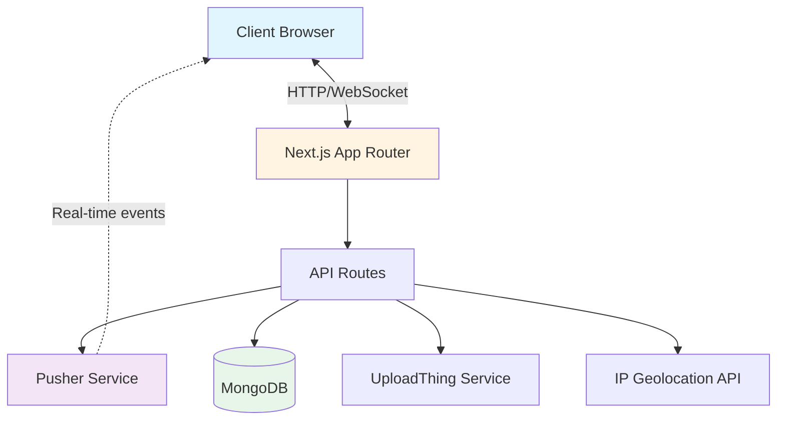
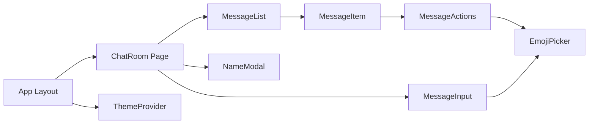

# Design Document

## Overview

The Global Live Chat Room is a real-time chat application built with Next.js 14+ (App Router), leveraging Pusher for WebSocket-based real-time communication, MongoDB for message persistence, and UploadThing for file uploads. The architecture follows a serverless approach optimized for Vercel deployment, with a focus on minimal bundle size, fast load times, and Apple-inspired UI aesthetics.

### Technology Stack

- **Frontend**: Next.js 14+ (App Router), React 18+, TypeScript
- **Styling**: Tailwind CSS with custom design system
- **Real-time**: Pusher Channels (WebSocket)
- **Database**: MongoDB with Mongoose ODM
- **File Storage**: UploadThing
- **Geolocation**: IP-API or similar service for country detection
- **State Management**: React Context + hooks (minimal external dependencies)
- **Deployment**: Vercel

## Architecture

### High-Level Architecture



### Component Architecture



## Components and Interfaces

### Core Components

#### 1. ChatRoom (Main Page Component)
**Location**: `app/page.tsx`

**Responsibilities**:
- Initialize Pusher connection
- Manage user session (name, country flag)
- Coordinate message loading and real-time updates
- Handle theme state

**State**:
```typescript
interface ChatRoomState {
  messages: Message[];
  userName: string | null;
  userCountry: string;
  isLoading: boolean;
  isConnected: boolean;
}
```

#### 2. MessageList
**Location**: `components/MessageList.tsx`

**Responsibilities**:
- Render scrollable message feed
- Implement virtual scrolling for performance (react-window)
- Auto-scroll to bottom on new messages
- Handle scroll-to-parent for replies

**Props**:
```typescript
interface MessageListProps {
  messages: Message[];
  currentUser: string;
  onReply: (message: Message) => void;
  onReact: (messageId: string, emoji: string) => void;
  onEdit: (messageId: string, newContent: string) => void;
  onDelete: (messageId: string) => void;
}
```

#### 3. MessageItem
**Location**: `components/MessageItem.tsx`

**Responsibilities**:
- Display individual message with metadata
- Show timestamp, flag, username
- Render attachments (images inline, files as links)
- Display reply context
- Show reactions with counts
- Provide action menu (edit, delete, reply, react)

**Props**:
```typescript
interface MessageItemProps {
  message: Message;
  isOwn: boolean;
  onReply: () => void;
  onReact: (emoji: string) => void;
  onEdit: (newContent: string) => void;
  onDelete: () => void;
}
```

#### 4. MessageInput
**Location**: `components/MessageInput.tsx`

**Responsibilities**:
- Text input with auto-resize
- File attachment handling
- Reply context display
- Send message on Enter (Shift+Enter for newline)
- Character count display

**Props**:
```typescript
interface MessageInputProps {
  onSend: (content: string, attachments: Attachment[], replyTo?: string) => void;
  replyingTo: Message | null;
  onCancelReply: () => void;
}
```

#### 5. EmojiPicker
**Location**: `components/EmojiPicker.tsx`

**Responsibilities**:
- Display quick reactions (5 emojis)
- Show extended palette (50 emojis) on demand
- Handle emoji selection

**Props**:
```typescript
interface EmojiPickerProps {
  onSelect: (emoji: string) => void;
  mode: 'quick' | 'extended';
}
```

**Emoji Sets**:
- Quick: 👍, ❤️, 😂, 😮, 😢
- Extended: Organized in categories (smileys, gestures, objects, symbols)

#### 6. MessageActions
**Location**: `components/MessageActions.tsx`

**Responsibilities**:
- Show/hide action menu on hover/long-press
- Display edit, delete, reply buttons
- Show emoji picker trigger
- Enforce 10-minute time limit

**Props**:
```typescript
interface MessageActionsProps {
  message: Message;
  isOwn: boolean;
  onReply: () => void;
  onEdit: () => void;
  onDelete: () => void;
  onReact: () => void;
}
```

#### 7. NameModal
**Location**: `components/NameModal.tsx`

**Responsibilities**:
- Prompt for initial name selection
- Allow name changes
- Validate name input (1-30 chars, alphanumeric)
- Save to localStorage

**Props**:
```typescript
interface NameModalProps {
  isOpen: boolean;
  currentName?: string;
  onSubmit: (name: string) => void;
}
```

#### 8. ThemeProvider
**Location**: `components/ThemeProvider.tsx`

**Responsibilities**:
- Manage theme state (dark/light)
- Persist theme preference
- Provide theme toggle function
- Apply theme classes to document

**Context**:
```typescript
interface ThemeContext {
  theme: 'dark' | 'light';
  toggleTheme: () => void;
}
```

### API Routes

#### 1. POST /api/messages
**Purpose**: Create new message

**Request**:
```typescript
{
  content: string;
  userName: string;
  userCountry: string;
  attachments?: Attachment[];
  replyTo?: string;
}
```

**Response**:
```typescript
{
  message: Message;
}
```

**Logic**:
1. Validate input
2. Detect user's country from IP (cache in session)
3. Upload attachments to UploadThing if present
4. Save message to MongoDB
5. Trigger Pusher event on 'chat-room' channel
6. Return created message

#### 2. GET /api/messages
**Purpose**: Fetch recent messages

**Query Params**:
- `limit`: number (default 50)
- `before`: timestamp (for pagination)

**Response**:
```typescript
{
  messages: Message[];
  hasMore: boolean;
}
```

#### 3. PATCH /api/messages/[id]
**Purpose**: Edit message

**Request**:
```typescript
{
  content: string;
  userName: string; // for ownership verification
}
```

**Response**:
```typescript
{
  message: Message;
}
```

**Logic**:
1. Verify message exists and is < 10 minutes old
2. Verify userName matches original sender
3. Update message in MongoDB
4. Trigger Pusher update event
5. Return updated message

#### 4. DELETE /api/messages/[id]
**Purpose**: Delete message

**Request**:
```typescript
{
  userName: string; // for ownership verification
}
```

**Response**:
```typescript
{
  success: boolean;
}
```

**Logic**:
1. Verify message exists and is < 10 minutes old
2. Verify userName matches original sender
3. Delete message from MongoDB
4. Trigger Pusher delete event
5. Return success

#### 5. POST /api/reactions
**Purpose**: Add or remove reaction

**Request**:
```typescript
{
  messageId: string;
  emoji: string;
  userName: string;
  action: 'add' | 'remove';
}
```

**Response**:
```typescript
{
  reactions: Reaction[];
}
```

**Logic**:
1. Find message in MongoDB
2. Add or remove reaction from reactions array
3. Update message document
4. Trigger Pusher reaction event
5. Return updated reactions

#### 6. GET /api/country
**Purpose**: Get user's country from IP

**Response**:
```typescript
{
  countryCode: string;
  countryFlag: string;
}
```

**Logic**:
1. Extract IP from request headers
2. Call IP geolocation API (cache result)
3. Return country code and flag emoji

## Data Models

### Message Model

```typescript
interface Message {
  _id: string;
  content: string;
  userName: string;
  userCountry: string; // ISO country code
  timestamp: Date;
  attachments: Attachment[];
  replyTo?: string; // Message ID
  reactions: Reaction[];
  edited: boolean;
  editedAt?: Date;
}
```

**MongoDB Schema**:
```javascript
const MessageSchema = new Schema({
  content: { type: String, required: true, maxlength: 5000 },
  userName: { type: String, required: true, maxlength: 30 },
  userCountry: { type: String, required: true, length: 2 },
  timestamp: { type: Date, default: Date.now, index: true },
  attachments: [{
    type: { type: String, enum: ['image', 'file'] },
    url: String,
    name: String,
    size: Number
  }],
  replyTo: { type: Schema.Types.ObjectId, ref: 'Message' },
  reactions: [{
    emoji: String,
    userName: String
  }],
  edited: { type: Boolean, default: false },
  editedAt: Date
});

// Index for efficient querying
MessageSchema.index({ timestamp: -1 });
```

### Attachment Interface

```typescript
interface Attachment {
  type: 'image' | 'file';
  url: string;
  name: string;
  size: number; // bytes
}
```

### Reaction Interface

```typescript
interface Reaction {
  emoji: string;
  userName: string;
}
```

## Real-time Communication

### Pusher Channel Structure

**Channel**: `chat-room`

**Events**:

1. **new-message**
   - Triggered when a message is created
   - Payload: `Message`

2. **update-message**
   - Triggered when a message is edited
   - Payload: `{ messageId: string, content: string, edited: true, editedAt: Date }`

3. **delete-message**
   - Triggered when a message is deleted
   - Payload: `{ messageId: string }`

4. **new-reaction**
   - Triggered when a reaction is added/removed
   - Payload: `{ messageId: string, reactions: Reaction[] }`

### Client-side Pusher Integration

```typescript
// Initialize Pusher client
const pusher = new Pusher(process.env.NEXT_PUBLIC_PUSHER_KEY!, {
  cluster: process.env.NEXT_PUBLIC_PUSHER_CLUSTER!
});

const channel = pusher.subscribe('chat-room');

// Listen for events
channel.bind('new-message', (message: Message) => {
  setMessages(prev => [...prev, message]);
});

channel.bind('update-message', (data) => {
  setMessages(prev => prev.map(msg => 
    msg._id === data.messageId ? { ...msg, ...data } : msg
  ));
});

channel.bind('delete-message', (data) => {
  setMessages(prev => prev.filter(msg => msg._id !== data.messageId));
});

channel.bind('new-reaction', (data) => {
  setMessages(prev => prev.map(msg =>
    msg._id === data.messageId ? { ...msg, reactions: data.reactions } : msg
  ));
});
```

## Design System

### Color Palette

**Light Theme**:
```css
--background: #ffffff
--surface: #f5f5f7
--surface-elevated: #ffffff
--text-primary: #1d1d1f
--text-secondary: #6e6e73
--accent: #007aff
--accent-hover: #0051d5
--border: #d2d2d7
--error: #ff3b30
--success: #34c759
```

**Dark Theme**:
```css
--background: #000000
--surface: #1c1c1e
--surface-elevated: #2c2c2e
--text-primary: #f5f5f7
--text-secondary: #98989d
--accent: #0a84ff
--accent-hover: #409cff
--border: #38383a
--error: #ff453a
--success: #32d74b
```

### Typography

**Font Stack**:
```css
font-family: -apple-system, BlinkMacSystemFont, 'SF Pro Display', 'Segoe UI', 
             'Roboto', 'Helvetica Neue', Arial, sans-serif;
```

**Type Scale**:
- Display: 28px / 700
- Heading: 20px / 600
- Body: 16px / 400
- Caption: 14px / 400
- Small: 12px / 400

### Spacing System

Based on 4px grid:
- xs: 4px
- sm: 8px
- md: 16px
- lg: 24px
- xl: 32px
- 2xl: 48px

### Border Radius

- sm: 8px (buttons, inputs)
- md: 12px (cards, modals)
- lg: 16px (large containers)
- full: 9999px (pills, avatars)

### Animations

**Durations**:
- Fast: 150ms (hover states)
- Normal: 250ms (transitions)
- Slow: 350ms (modals, drawers)

**Easing**:
```css
--ease-out: cubic-bezier(0.16, 1, 0.3, 1);
--ease-in-out: cubic-bezier(0.45, 0, 0.15, 1);
```

## Mobile Optimization

### Responsive Breakpoints

```css
sm: 640px   /* Mobile landscape */
md: 768px   /* Tablet */
lg: 1024px  /* Desktop */
xl: 1280px  /* Large desktop */
```

### Touch Interactions

1. **Long Press**: 500ms hold to show message actions
2. **Swipe Right**: Swipe message to reply
3. **Pull to Refresh**: Pull down message list to load older messages
4. **Tap Targets**: Minimum 44x44px for all interactive elements

### Mobile-Specific Features

- Virtual keyboard handling (adjust viewport on keyboard open)
- Prevent zoom on input focus
- Native file picker integration
- Haptic feedback on actions (if supported)

## Performance Optimizations

### Code Splitting

```typescript
// Lazy load heavy components
const EmojiPicker = dynamic(() => import('@/components/EmojiPicker'), {
  loading: () => <div>Loading...</div>
});

const ImageViewer = dynamic(() => import('@/components/ImageViewer'));
```

### Virtual Scrolling

Use `react-window` for message list to render only visible messages:

```typescript
<FixedSizeList
  height={600}
  itemCount={messages.length}
  itemSize={80}
  width="100%"
>
  {({ index, style }) => (
    <div style={style}>
      <MessageItem message={messages[index]} />
    </div>
  )}
</FixedSizeList>
```

### Image Optimization

- Use Next.js Image component for attachments
- Lazy load images below the fold
- Generate thumbnails for large images
- Use WebP format with fallbacks

### Bundle Size Targets

- Initial JS: < 200KB gzipped
- CSS: < 20KB gzipped
- Total FCP: < 1s on broadband
- Total TTI: < 2s on broadband

### Caching Strategy

1. **Static Assets**: Cache-Control: public, max-age=31536000, immutable
2. **API Responses**: No caching (real-time data)
3. **User Data**: localStorage for name, theme, country
4. **Message History**: IndexedDB for offline access (optional enhancement)

## Error Handling

### Client-Side Error Boundaries

```typescript
<ErrorBoundary fallback={<ErrorFallback />}>
  <ChatRoom />
</ErrorBoundary>
```

### API Error Responses

Standard error format:
```typescript
{
  error: string;
  code: string;
  details?: any;
}
```

**Error Codes**:
- `INVALID_INPUT`: Validation failed
- `UNAUTHORIZED`: User verification failed
- `NOT_FOUND`: Resource not found
- `RATE_LIMIT`: Too many requests
- `SERVER_ERROR`: Internal server error
- `EDIT_EXPIRED`: 10-minute edit window expired

### Pusher Connection Handling

```typescript
pusher.connection.bind('error', (err) => {
  console.error('Pusher error:', err);
  setConnectionStatus('error');
});

pusher.connection.bind('disconnected', () => {
  setConnectionStatus('disconnected');
  // Attempt reconnection
});

pusher.connection.bind('connected', () => {
  setConnectionStatus('connected');
});
```

### Offline Handling

- Display offline indicator when network is unavailable
- Queue messages for sending when connection restored
- Show cached messages from localStorage/IndexedDB

## Testing Strategy

### Unit Tests

**Tools**: Jest, React Testing Library

**Coverage**:
- Utility functions (date formatting, URL detection, validation)
- React hooks (useMessages, useTheme, usePusher)
- Component rendering and interactions

**Example**:
```typescript
describe('MessageItem', () => {
  it('displays message content and metadata', () => {
    render(<MessageItem message={mockMessage} />);
    expect(screen.getByText(mockMessage.content)).toBeInTheDocument();
  });

  it('shows edit button only for own messages < 10 minutes old', () => {
    // Test logic
  });
});
```

### Integration Tests

**Tools**: Playwright or Cypress

**Scenarios**:
- Complete message flow (send, receive, edit, delete)
- Real-time updates across multiple clients
- File upload and display
- Theme switching
- Mobile responsive behavior

### Performance Tests

**Tools**: Lighthouse CI, WebPageTest

**Metrics**:
- First Contentful Paint < 1s
- Time to Interactive < 2s
- Cumulative Layout Shift < 0.1
- Largest Contentful Paint < 2.5s

### Manual Testing Checklist

- [ ] Cross-browser compatibility (Chrome, Firefox, Safari, Edge)
- [ ] Mobile devices (iOS Safari, Android Chrome)
- [ ] Theme switching
- [ ] Real-time message delivery
- [ ] File uploads (images and documents)
- [ ] Edit/delete time limits
- [ ] Emoji reactions
- [ ] Reply threading
- [ ] Accessibility (keyboard navigation, screen readers)

## Security Considerations

### Input Validation

- Sanitize all user input to prevent XSS
- Validate message length (max 5000 chars)
- Validate file types and sizes
- Rate limit API endpoints (10 requests/minute per IP)

### Authentication

- No traditional auth required
- Use session-based userName verification for edit/delete
- Consider adding optional password protection for names

### Data Privacy

- No PII collection beyond IP-based country detection
- Clear data retention policy (e.g., messages older than 30 days)
- GDPR compliance considerations

### Environment Variables

All sensitive keys stored in Vercel environment variables:
- `PUSHER_APP_ID`, `PUSHER_KEY`, `PUSHER_SECRET`, `PUSHER_CLUSTER`
- `MONGODB_URI`
- `UPLOADTHING_SECRET`, `UPLOADTHING_TOKEN`
- `NEXT_PUBLIC_PUSHER_KEY`, `NEXT_PUBLIC_PUSHER_CLUSTER`

## Deployment

### Vercel Configuration

**vercel.json**:
```json
{
  "buildCommand": "npm run build",
  "devCommand": "npm run dev",
  "installCommand": "npm install",
  "framework": "nextjs",
  "regions": ["iad1"]
}
```

### Environment Setup

1. Configure all environment variables in Vercel dashboard
2. Set up MongoDB Atlas cluster with connection string
3. Configure Pusher app and channels
4. Set up UploadThing project

### Build Optimization

- Enable Next.js compiler optimizations
- Use SWC for faster builds
- Enable image optimization
- Configure proper caching headers

### Monitoring

- Vercel Analytics for performance metrics
- Error tracking (Sentry or similar)
- Pusher dashboard for WebSocket metrics
- MongoDB Atlas monitoring for database performance
