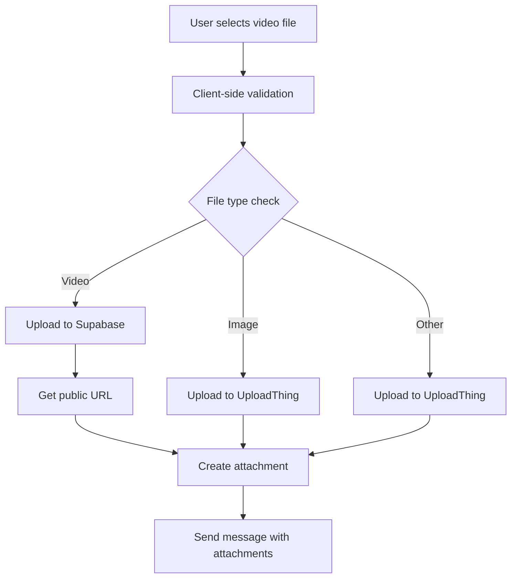

# Video Upload Feature - Supabase Integration

## Overview

This document describes the video upload feature that uses Supabase storage for hosting video files in the Light Global Chat application.

## Key Features

### 1. Supabase Video Storage
- **Storage Location**: Videos are stored in Supabase Storage bucket named `chat-videos`
- **File Organization**: Videos are organized by date (`videos/YYYY-MM-DD/filename.ext`)
- **Public Access**: Videos are served via public URLs for streaming

### 2. Supported Video Formats

The following video formats are supported:

- **MP4** (`video/mp4`) - Most widely compatible
- **QuickTime** (`video/quicktime`) - Apple devices
- **AVI** (`video/x-msvideo`) - Windows compatibility
- **Matroska** (`video/x-matroska`) - High quality container
- **WebM** (`video/webm`) - Web-optimized format
- **OGG** (`video/ogg`) - Open standard format
- **3GP** (`video/3gpp`) - Mobile devices
- **3G2** (`video/3gpp2`) - Mobile devices

### 3. File Size Limits

- **Maximum Video Size**: 50 MB per file
- **Total Attachments**: Maximum 8 attachments per message (including images, videos, and files)

### 4. Browser Compatibility

The video player includes special attributes for cross-browser compatibility:

- **iPhone/iOS Safari**: `playsInline` and `webkit-playsinline="true"`
- **All Browsers**: `preload="metadata"` for better streaming
- **Fallback**: Text fallback for browsers without video support

### 5. Upload Flow



## Setup Instructions

### 1. Supabase Configuration

Add these environment variables to your `.env` file:

```env
NEXT_PUBLIC_SUPABASE_URL="https://your-project.supabase.co"
NEXT_PUBLIC_SUPABASE_ANON_KEY="your-public-key"
SUPABASE_SERVICE_ROLE_KEY="your-service-role-key"
```

### 2. Create Storage Bucket

**The system will automatically create the bucket if it doesn't exist**, but you can also create it manually:

#### Manual Bucket Creation:

1. Go to your Supabase project dashboard: [https://app.supabase.com](https://app.supabase.com)
2. Navigate to the "Storage" section in the left sidebar
3. Click the "New Bucket" button
4. Name the bucket exactly: `chat-videos`
5. Set "Public" to ON (for video streaming)
6. Set file size limit to 50MB (or your preferred limit)
7. Add allowed MIME types: `video/mp4`, `video/quicktime`, `video/x-msvideo`, `video/x-matroska`, `video/webm`, `video/ogg`, `video/3gpp`, `video/3gpp2`
8. Click "Create Bucket"

#### Automatic Bucket Creation:

The system will automatically create the bucket with proper settings when you upload your first video. No manual setup required!

### 3. Update UploadThing Configuration

No changes needed - images continue to use UploadThing as before.

## Implementation Details

### Backend Changes

#### 1. Supabase Client (`lib/supabase.ts`)

- Creates Supabase client with admin and anon keys
- Provides video upload functionality
- Handles file validation and error management
- Generates public URLs for video playback

#### 2. Video Upload API (`app/api/upload-video/route.ts`)

- REST endpoint for video uploads
- Validates file type and size
- Uploads to Supabase storage
- Returns public URL and metadata

### Frontend Changes

#### 1. Message Input (`components/MessageInput.tsx`)

- Separates video files from other attachments
- Uploads videos to Supabase endpoint
- Uploads images to UploadThing (unchanged)
- Uploads other files to UploadThing (unchanged)
- Shows video previews in attachment list

#### 2. Message Display (`components/MessageItem.tsx`)

- Renders video attachments with proper controls
- Includes iOS/Safari compatibility attributes
- Maintains existing image and file rendering

#### 3. Media Viewer (`components/ImageViewer.tsx`)

- Supports video playback in full-screen mode
- Includes compatibility attributes
- Maintains existing image viewing functionality

### Configuration

#### Environment Variables

```env
# Supabase Configuration
NEXT_PUBLIC_SUPABASE_URL="https://your-project.supabase.co"
NEXT_PUBLIC_SUPABASE_ANON_KEY="your-public-key"
SUPABASE_SERVICE_ROLE_KEY="your-service-role-key"
```

#### UploadThing Configuration

No changes to UploadThing configuration - images continue to use UploadThing as before.

## Testing

### Manual Testing

1. **Upload Test**: Upload various video formats and verify they play correctly
2. **Size Test**: Verify 50MB limit is enforced
3. **Compatibility Test**: Test on iPhone, Safari, Firefox, Chrome
4. **Fallback Test**: Verify fallback text appears when video format is unsupported

### Automated Testing

Run the test script:

```bash
node scripts/test-video-upload.js
```

This tests:
- Supabase configuration
- API endpoint accessibility
- Video upload functionality
- File size validation
- Supported format listing

## Migration Notes

### From UploadThing to Supabase

- **Images**: Continue using UploadThing (no changes)
- **Videos**: Now use Supabase storage
- **Other Files**: Continue using UploadThing (no changes)

### Database Impact

No database changes required. The attachment structure remains the same:

```typescript
interface Attachment {
  type: 'image' | 'file' | 'video';
  url: string;
  name: string;
  size: number;
}
```

## Troubleshooting

### Bucket Not Found Error

If you see "bucket not found" error:

1. **Check Service Role Key**: Ensure your `SUPABASE_SERVICE_ROLE_KEY` has `storage.write` permissions
2. **Verify Bucket Name**: The bucket must be named exactly `chat-videos`
3. **Check Storage Quota**: Ensure you haven't exceeded Supabase storage limits
4. **Manual Creation**: If auto-creation fails, create the bucket manually as described in Setup Instructions
5. **Permissions**: Ensure the bucket has public read access for video streaming

### Common Issues

1. **Video not playing on iPhone**: Ensure `playsInline` attribute is present
2. **Upload fails**: Check Supabase storage permissions and bucket existence
3. **Large file errors**: Verify file size is under 50MB limit
4. **Format not supported**: Check that video format is in supported list

### Debugging Tips

- Check browser console for upload errors
- Verify Supabase storage bucket exists and has proper permissions
- Test with small video files first
- Check network tab for API responses

## Future Enhancements

1. **Video Transcoding**: Add automatic format conversion for better compatibility
2. **Thumbnail Generation**: Create video thumbnails for previews
3. **Progressive Loading**: Implement better streaming for large videos
4. **Analytics**: Track video views and engagement
5. **Access Control**: Add private video support with authentication

## Security Considerations

1. **File Validation**: Server-side validation of file types and sizes
2. **Public URLs**: Videos are publicly accessible via URL
3. **Rate Limiting**: Consider adding upload rate limits
4. **Content Moderation**: May need video content scanning

## Performance Optimization

1. **CDN**: Supabase provides CDN for storage files
2. **Preload**: `preload="metadata"` helps with streaming
3. **Compression**: Consider client-side compression for large videos
4. **Lazy Loading**: Videos load only when visible in chat

## References

- [Supabase Storage Documentation](https://supabase.com/docs/guides/storage)
- [HTML5 Video Element](https://developer.mozilla.org/en-US/docs/Web/HTML/Element/video)
- [iOS Video Playback](https://developer.apple.com/documentation/webkit/safari_web_content_configuring_your_content_for_safari)
- [Video Format Compatibility](https://caniuse.com/?search=video)